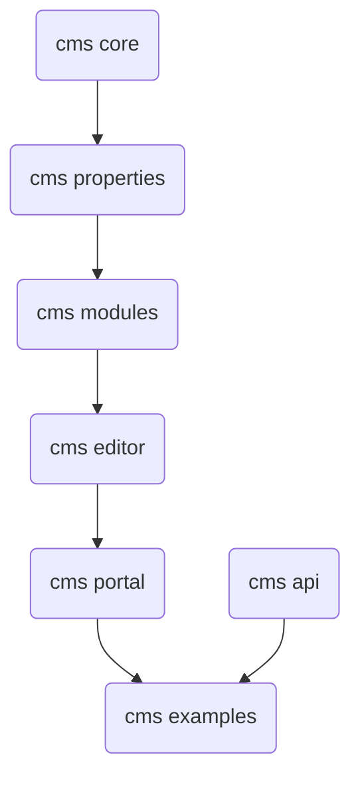

# Angular Cms

The cms based on Angular, NodeJs and MongoDB

## Prerequisites
Need to install
* Node
* MongoDB

## Module dependency



## How to run in dev mode

For running examples, we need set up the [symlinks](https://docs.npmjs.com/cli/link.html) between modules as below:

1. Go to `cms-api` folders and run command 
```
    npm link
``` 
2. Go to `cms\core` folders and run command 
```
    npm link
```

3. Go to `cms\properties` folder and run command 
``` 
    npm link @angular-cms/core

    npm link
```  
4. Go to `cms\modules` folder and run commands 

```
    npm link @angular-cms/core @angular-cms/properties

    npm link
```
5. Go to `cms\editor` folder and run commands

```
    npm link @angular-cms/core @angular-cms/properties @angular-cms/modules
    
    npm link
```
6. Go to `cms\portal` folder and run commands

```
    npm link @angular-cms/core @angular-cms/properties @angular-cms/modules @angular-cms/editor
```

7. Go to `cms-examples` folder and run commands

```
    npm link @angular-cms/api @angular-cms/core @angular-cms/properties @angular-cms/modules @angular-cms/editor
```
8. Final step, under `cms-examples` folder and run command
```
    npm run dev
```

## Versioning

We are current on Alpha

## Authors

* **Hung Dang Viet** - *Initial work and maintain* - [danghung1202](https://github.com/danghung1202)


## License

This project is licensed under the MIT License - see the [LICENSE.md](LICENSE.md) file for details

## Acknowledgments

* Inspiration from Episerver

