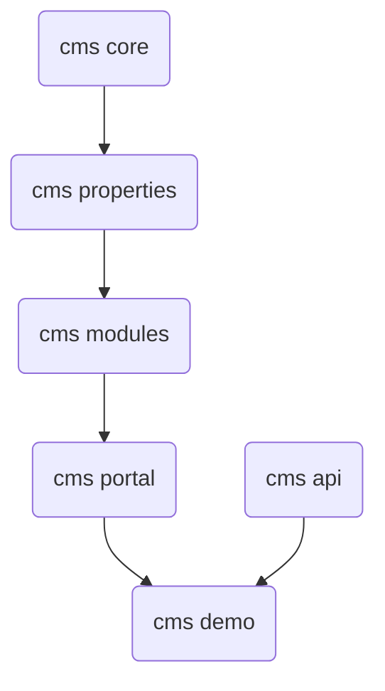

# Angular Cms

The single app CMS based on Angular, Express, NodeJs and MongoDB.

**HOPE THERE IS SOMEONE WORK WITH ME TO CREATE THE FUN. FEEL FREE TO CONTACT ME (danghung1202@gmail.com)**

## Prerequisites
Need to install
* Node.js version 10.9.0 or later
* MongoDB

## Module dependency



## How to run in dev mode

### Setup Npm Symlinks

For running examples, we need set up the [symlinks](https://docs.npmjs.com/cli/link.html) between modules as below:

1. Go to `cms-api` folders and run command 
```
    npm link
``` 

2. Go to `cms-server` folder and run commands

```
    npm link @angular-cms/api
```

### Run in Dev Mode

1. First step, under `cms-server` folder, run the command
```
    npm install
    npm run dev
```

This command will run script to connect to mongo db, so make sure you have the correct path to your db.
For example, in my local, I have the db path like as `D:/ProgramData/MongoDB/data/db`
```
    mongod --dbpath D:/ProgramData/MongoDB/data/db
```

2. Final step, under `cms` folder, run the command
```
    npm install
    ng build core
    ng build properties
    ng build modules
    ng build portal
    npm run dev
```
> Make sure you installed Angular CLI with `--global`

## Versioning

We are current on Alpha

## Authors

* **Hung Dang Viet** - *Initial work and maintain* - [danghung1202](https://github.com/danghung1202)


## License

This project is licensed under the MIT License - see the [LICENSE.md](LICENSE.md) file for details

## Acknowledgments

* Inspiration from Episerver

## Notes


