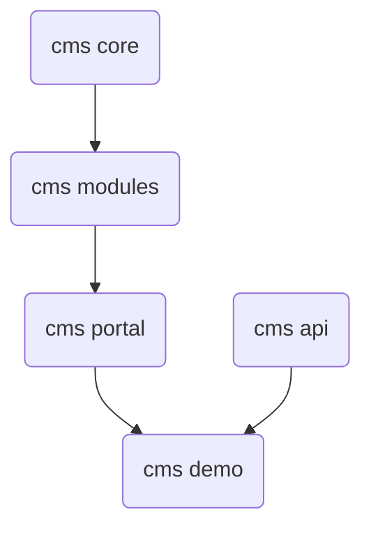

# Installation

## Prerequisites
Must install:
* Node.js version 10+ or later
* MongoDB latest
  
Optional:
* MongoDB Compass Community (Optional)
* Visual Studio Code

## Module dependency



## How to setup for development

### Setup Npm Symlinks

For running examples, we need set up the [symlinks](https://docs.npmjs.com/cli/link.html) between modules as below:

1. Go to `cms-api` folders and run command 
```
    npm install
    npm link
    npm run build
``` 

2. Go to `cms-server` folder and run commands

```
    npm link @typijs/api
```

### Run in Dev Mode

1. First step, under `cms-server` folder, run the command
```
    npm install
    npm run dev
```
> If you have the issue installing such as the `@typijs/api` package is not found, temporary remove it in package.json, run install command then add it again

This command will run script to connect to mongo db, so make sure you have the correct path to your db.
For example, in my local, I have the db path like as `D:/ProgramData/MongoDB/data/db`
```
    mongod --dbpath D:/ProgramData/MongoDB/data/db
```

> If you install the MongoDB and run it as the service in Window, you can skip this step

2.  After the MongDb instance running, you can use the example data under the resources/db/dump/angularcms using the MongoDb command `mongorestore` to backup these collections

For example, under the `resources/db` folder, run command line 

```
mongorestore  dump/

``` 
to restore from a dump directory to a local mongod instance running on port 27017:


3. Final step, under `cms` folder, run the command sequentially
```
    npm install
    ng build core
    ng build modules
    ng build portal
    npm run dev
```
> Make sure you installed Angular CLI with `--global`

### Run Angular Universal (SSR) in Dev mode

```
    npm install
    ng build core
    ng build modules
    ng build portal
    ng build
    ng run cms-demo:server
```
Copy three folders `dist\core`, `dist\modules` and `dist\portal` into `cms\node_modules\@typijs` folder then run this script to start Server Site Render

```
    npm run start:ssr
```

If there is any change these libs `core` or `modules` or `portal` need to run build for each lib again then run 

```
ng run cms-demo:server
```

and start server site again